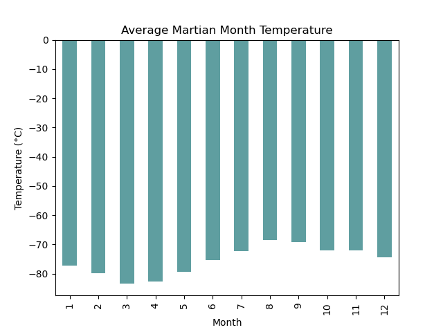
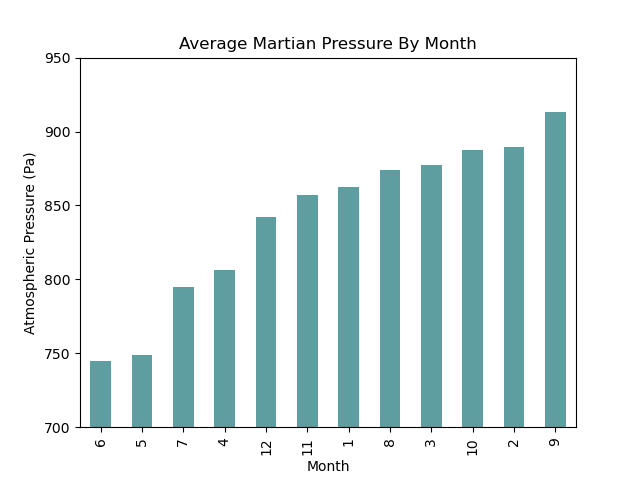
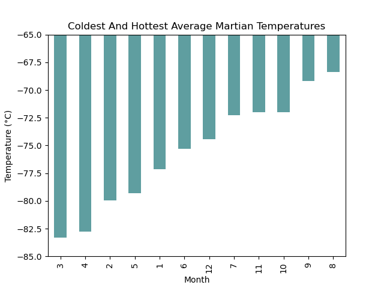
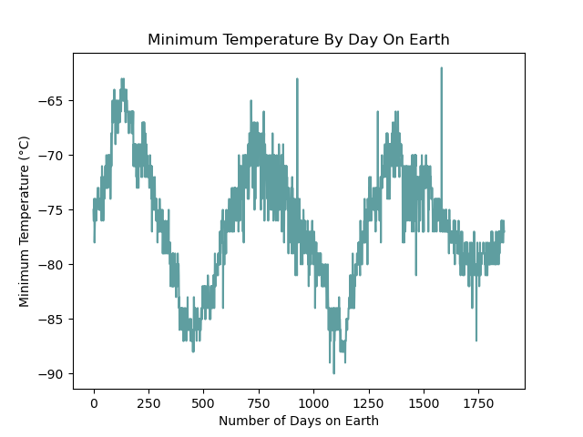

# data-scraping-challenge

This challenge uses Splinter, Beautiful Soup, and Pandas to scape and analyze data on Mars news and weather. 

## Code Notes
The JSON and CSV export files can be found in the main folder.

## Reference Charts

_Average monthly Martian temperatures_

_Average Martian atmospheric pressure_

_Coldest and hottest Martian temperatures_

_Minimum temperatures on Mars by days on Earth_
